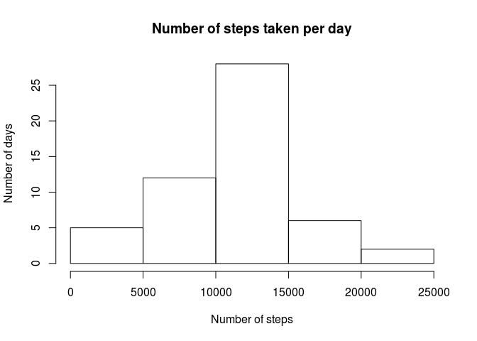
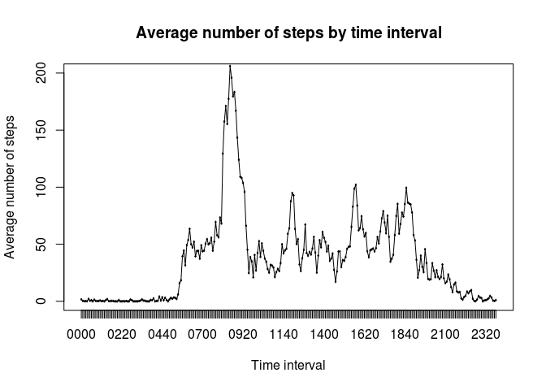
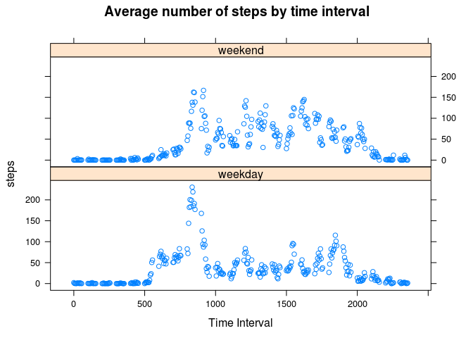
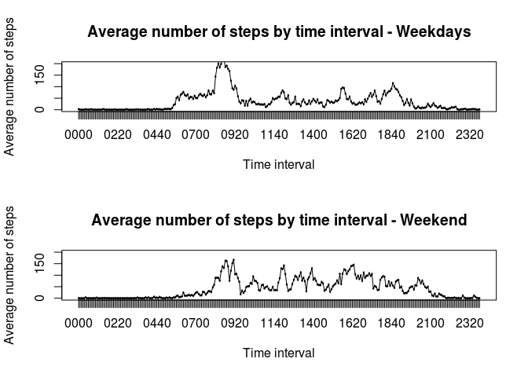

# Reproducible Research: Peer Assessment 1
Prepared by John Romankiewicz, Berkeley, CA
Date: 11/10/2015

First you'll need to clone the repository at this link:
http://github.com/rdpeng/RepData_PeerAssessment1
Now, let's import the data and clean it up a bit.

```r
temp <- unzip("activity.zip")
data <- read.csv(temp, header=T)
```

## Question 1: What is mean total number of steps taken per day?

Below, we will calculate the mean and median number of steps taken per day, as well as provide a histogram of the number of steps.


```r
dataSum <- aggregate(x = data[c("steps", "interval")],FUN=sum, by = list(Group.date = data$date))
meanSteps <- round(mean(dataSum$steps, na.rm=TRUE), digits = 0)
medianSteps <- median(dataSum$steps, na.rm=TRUE)
hist(dataSum$steps, xlab="Number of steps", ylab="Number of days", main="Number of steps taken per day")
```

 

The mean number of steps is 1.0766\times 10^{4}, and the median number of steps taken per day is 10765.

## Question 2: What is the average daily activity pattern?

Now we will make a time series plot of the average number of steps taken per 5-minute time interval, averaged over all days.


```r
dataSum2 <- aggregate(x = data[c("steps")],FUN=mean, by=list(Group.interval = data$interval), na.rm=TRUE)
maxInt = sprintf("%04d", dataSum2[which.max(dataSum2$steps),1])
dataSum2$Group.interval <- sprintf("%04d",dataSum2$Group.interval)
dataSum2$Group.interval <- as.factor(dataSum2$Group.interval)
plot(dataSum2$Group.interval, dataSum2$steps, type="l", ylim=c(0,200), xlab="Time interval", ylab="Average number of steps", main="Average number of steps by time interval")
lines(dataSum2$Group.interval, dataSum2$steps)
```

 

The 5-minute interval with the maximum number of steps is 0835.

## Question 3: Imputing missing values

There are a number of days/intervals where there are missing values (coded as NA). The presence of missing days may introduce bias into some calculations or summaries of the data.


```r
missingData <- nrow(data) - sum(complete.cases(data))
```

There are 2304 rows with missing values. Now, we will fill in the rows with missingData using the mean for that 5-minute interval. Then, we will recalculate the mean and median number of steps to see how our calculations have changed now that there are no missing values.


```r
dataSum2 <- aggregate(x = data[c("steps")],FUN=mean, by=list(Group.interval = data$interval), na.rm=TRUE)

for (i in 1:nrow(data)) {
  if (is.na(data[i,1])) {
    count <- ((data[i,3]%/%100)*12)+((data[i,3]%%100)/5)+1
    data[i,1] <- dataSum2[count,2]
  }
}

nomissingData <- nrow(data) - sum(complete.cases(data))
newDataSum <- aggregate(x = data[c("steps", "interval")],FUN=sum, by = list(Group.date = data$date))
newMeanSteps <- round(mean(newDataSum$steps), digits=0)
newMedianSteps <- median(newDataSum$steps)
hist(newDataSum$steps, xlab="Number of steps", ylab="Number of days", main="Number of steps taken per day")
```

 

Now there are 0 rows with missing values. The new mean number of steps is 1.0766\times 10^{4}, and the median number of steps taken per day is 1.0766189\times 10^{4}. By imputing the missing data, the estimates did not change. It seems this is because the NA values are confined to certain days, and so in calculating a mean number of steps per day, the first mean calculated the mean out of 53 days, while the second mean calculated the mean (with increased numerator) out of 61 days.

## Question 4: Are there differences in activity patterns between weekdays and weekends?

Here, we will see if there is a difference in activity patterns between weekdays and weekends. This simply requires using the "is.weekend" function to see if a day is a weekday or a weekend. Then, I used the lattice package and the base package to plot the patterns in two different ways.


```r
library(chron)
library(lattice)
data$date <- as.Date(data$date)
data$yesnoweekend <- is.weekend(data$date)
dataSum3 <- aggregate(x = data[c("steps")],FUN=mean, by=list(Group.interval = data$interval, Group.WeekdayOrEnd = data$yesnoweekend), na.rm=TRUE)
attach(dataSum3)
Group.WeekdayOrEnd.f <- factor(Group.WeekdayOrEnd, levels=c(FALSE, TRUE), labels=c("weekday", "weekend"))

xyplot(steps~Group.interval|Group.WeekdayOrEnd.f,
   main="Average number of steps by time interval",
   xlab="Time Interval",
   layout=c(1,2))
```

 

```r
weekdaysubset <- subset(data, yesnoweekend == FALSE)
weekendsubset <- subset(data, yesnoweekend == TRUE)
dataSumWeekday <- aggregate(x = weekdaysubset[c("steps")],FUN=mean, by=list(Group.interval = weekdaysubset$interval), na.rm=TRUE)
dataSumWeekend <- aggregate(x = weekendsubset[c("steps")],FUN=mean, by=list(Group.interval = weekendsubset$interval), na.rm=TRUE)
dataSumWeekday$Group.interval <- sprintf("%04d",dataSumWeekday$Group.interval)
dataSumWeekday$Group.interval <- as.factor(dataSumWeekday$Group.interval)
dataSumWeekend$Group.interval <- sprintf("%04d",dataSumWeekend$Group.interval)
dataSumWeekend$Group.interval <- as.factor(dataSumWeekend$Group.interval)
par(mfrow=c(2,1))
plot(dataSumWeekday$Group.interval, dataSumWeekday$steps, type="l", ylim=c(0,200), xlab="Time interval", ylab="Average number of steps", main="Average number of steps by time interval - Weekdays")
lines(dataSumWeekday$Group.interval, dataSumWeekday$steps)
plot(dataSumWeekend$Group.interval, dataSumWeekend$steps, type="l", ylim=c(0,200), xlab="Time interval", ylab="Average number of steps", main="Average number of steps by time interval - Weekend")
lines(dataSumWeekend$Group.interval, dataSumWeekend$steps)
```

 
